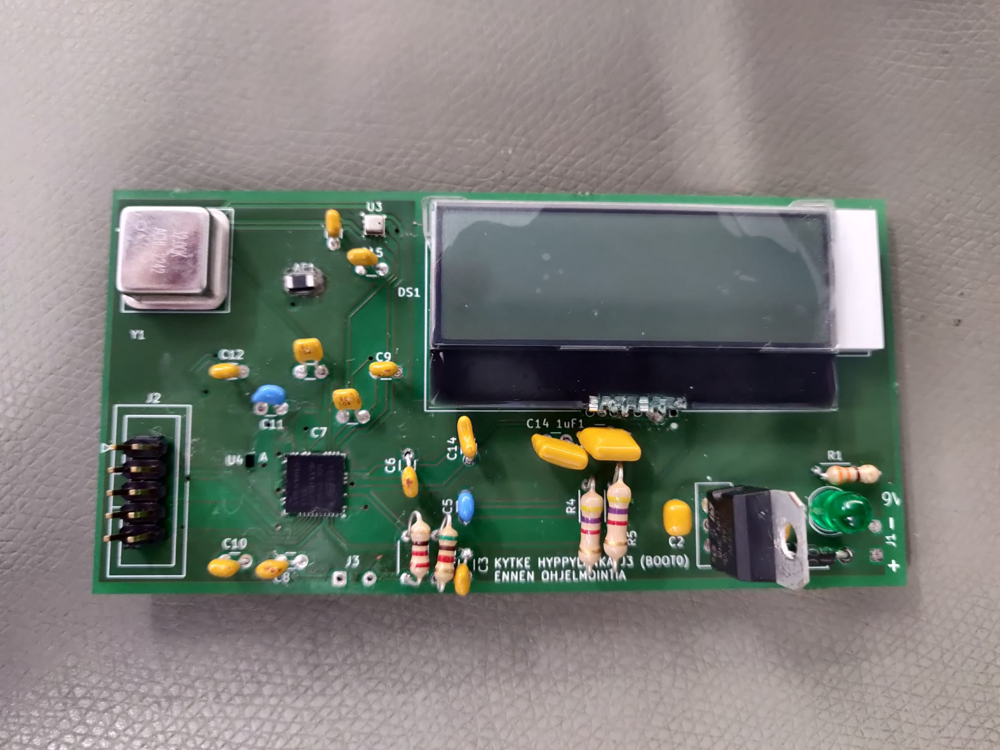

# Project Overview

The primary goal of this project was to intricately design the electronics and circuit board for a sophisticated embedded device. By harnessing our team's deep technical expertise, we set out to develop a high-end wireless weather station. This system is powered by the STM32WB microcontroller, renowned for its high performance and reliability in handling wireless communications.

## Implementation Details

Our team is committed to providing a comprehensive solution that not only measures various environmental parameters accurately but also facilitates efficient data transmission through wireless networks. At the heart of our design, the STM32WB microcontroller boasts Bluetooth capabilities, making it an excellent choice for our advanced weather monitoring system.

## Key Features

- **Real-Time Environmental Monitoring:** The station is capable of measuring temperature and humidity.
- **Energy-Efficient Design:** Focuses on low power consumption, ideal for long-term deployment in remote areas with minimal maintenance requirements.

This project is a testament to our team's dedication to pushing the boundaries of innovation and excellence in embedded systems design.

## Pics

# PCB

# PCB-schema

# 3D-pic

# Built PCB

# STM close-up

